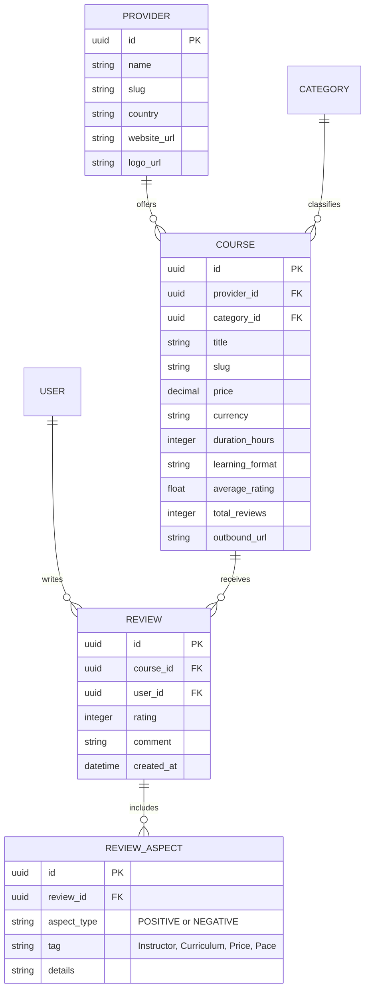

# 🏗️ Architecture & Technical Design Document

This document outlines the architectural principles, system design, data flows, and infrastructure models for the **Unified Course App**.

---

## 1. High-Level System Architecture (C4 Model)

```
                                    ┌───────────────────────┐
                                    │    Learner Client     │
                                    │ (Mobile/Tablet/Web)   │
                                    └───────────┬───────────┘
                                                │ HTTPS
                                                ▼
┌───────────────────────────────────────────────────────────────────────────────────┐
│                               NEXT.JS APPLICATION LAYER                           │
│                                                                                   │
│  ┌───────────────────────┐   ┌───────────────────────┐   ┌─────────────────────┐  │
│  │   Server Components   │   │     Route Handlers    │   │  Server Actions     │  │
│  │ (SEO SSR/SSG Engine)  │   │  (REST / External)    │   │ (Filter/Comparison) │  │
│  └───────────┬───────────┘   └───────────┬───────────┘   └──────────┬──────────┘  │
└──────────────┼───────────────────────────┼──────────────────────────┼─────────────┘
               │                           │                          │
               └───────────────────────────┼──────────────────────────┘
                                           │ Prisma / Drizzle ORM
                                           ▼
┌───────────────────────────────────────────────────────────────────────────────────┐
│                              POSTGRESQL DATA STORE                                │
│                                                                                   │
│  ┌───────────────────────┐   ┌───────────────────────┐   ┌─────────────────────┐  │
│  │   Courses & Providers │   │ Reviews & Pros/Cons   │   │ Bengali Dictionary  │  │
│  │  Relational Catalog   │   │   Aspect Sentiment    │   │ pg_trgm & GIN Index │  │
│  └───────────────────────┘   └───────────────────────┘   └─────────────────────┘  │
└───────────────────────────────────────────────────────────────────────────────────┘
```

---

## 2. Cross-Lingual Bengali-to-English Search Pipeline (FR-07, FR-08, FR-09)

When a user submits a query in Bengali (e.g. `কম্পিউটার প্রোগ্রামিং` or `জিআরই প্রস্তুতি`):

```
User Query (Bengali)
        │
        ▼
[Normalization & Tokenization] ── Cleans diacritics, splits into base tokens
        │
        ▼
[Dictionary & Synonym Mapping] ── Maps Bengali tokens to English educational terms:
                                  "কম্পিউটার প্রোগ্রামিং" ──> ["Computer Programming", "Software", "Coding"]
                                  "জিআরই" ───────────────> ["GRE", "Graduate Record Examination"]
        │
        ▼
[Fuzzy Trigram Matching (pg_trgm)] ── Matches against Course Titles, Descriptions & Categories
        │
        ▼
[Ranked Search Result Set] ── Sorted by relevancy, rating, and enrollment score
```

---

## 3. Database Entity Relationship (ERD) Overview



---

## 4. Multi-Criteria Filtering Strategy (FR-01 to FR-03)

1. **State URL Sync:** All applied filter combinations are serialized into URL query params (`/courses?cat=it&price_max=100&rating_min=4&lang=en,bn`), enabling bookmarking, social sharing, and SEO indexing.
2. **Server-Side Execution:** Filters are executed directly against indexed PostgreSQL columns (`B-tree` on price/rating, `GIN` on tags/languages) ensuring sub-50ms query response times.

---

## 5. Security Architecture & Rate Limiting

- **Input Sanitization:** Strict Zod schema validation across all API routes and form inputs.
- **Outbound Link Hardening:** Direct redirection links use `rel="noopener noreferrer"` and validate against an allowed provider domain whitelist to prevent open redirect vulnerabilities.
- **Role-Based Access Control (RBAC):** Admin, Moderator, and Learner tiers enforced through JWT session claims.
